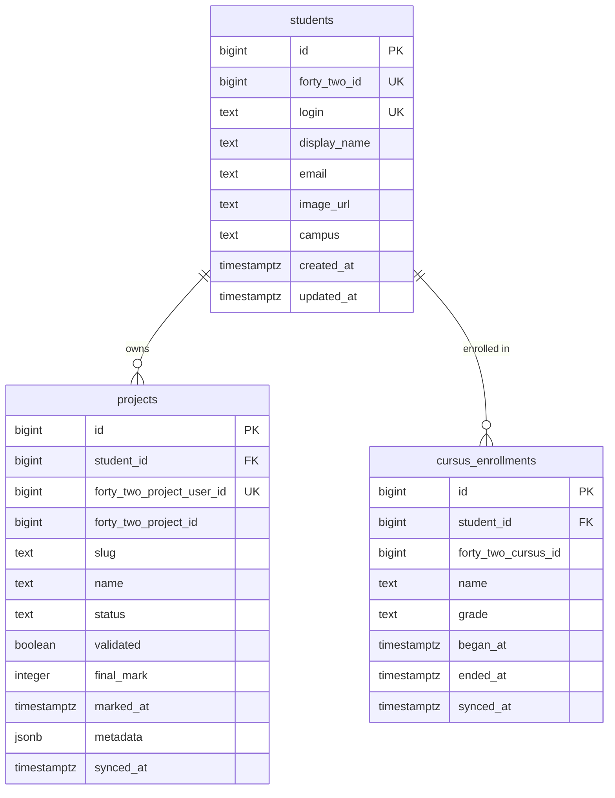

# Database Schema — 42 Student Login App

The application keeps a local copy of the student profile and project progress fetched from the 42 Intra API. PostgreSQL stores the data with the following schema.

## Tables

### `students`

| Column | Type | Notes |
| ------ | ---- | ----- |
| `id` | `bigserial` | Primary key used internally. |
| `forty_two_id` | `bigint` | Stable 42 user identifier. Unique. |
| `login` | `text` | Intra login (intraname). Unique for quick lookups. |
| `display_name` | `text` | Preferred display name from 42 (`displayname` or `usual_full_name`). |
| `email` | `text` | Public email if exposed by the API (nullable). |
| `image_url` | `text` | Avatar link (nullable). |
| `campus` | `text` | Primary campus label (nullable). |
| `created_at` | `timestamptz` | When the row was inserted. Defaults to `now()`. |
| `updated_at` | `timestamptz` | When the record was last synced. Updated on each sync. |

### `projects`

Stores project progress per student, including finished and in-progress items.

| Column | Type | Notes |
| ------ | ---- | ----- |
| `id` | `bigserial` | Primary key. |
| `student_id` | `bigint` | FK → `students.id`. |
| `forty_two_project_user_id` | `bigint` | Identifier of the project-user join (`projects_users.id`). Unique. |
| `forty_two_project_id` | `bigint` | ID of the project. Useful for grouping across students. |
| `slug` | `text` | Project slug from 42 (`slug`). |
| `name` | `text` | Human readable name. |
| `status` | `text` | Project status (`finished`, `in_progress`, `waiting_for_correction`, etc.). |
| `validated` | `boolean` | Whether the project has been validated. |
| `final_mark` | `integer` | Final mark (nullable until graded). |
| `marked_at` | `timestamptz` | When the project was graded (nullable). |
| `metadata` | `jsonb` | Raw 42 payload for auditing / future fields. |
| `synced_at` | `timestamptz` | Last time we updated this row from 42. |

### `cursus_enrollments`

Optional table if you need to capture cursus/track progress.

| Column | Type | Notes |
| ------ | ---- | ----- |
| `id` | `bigserial` | Primary key. |
| `student_id` | `bigint` | FK → `students.id`. |
| `forty_two_cursus_id` | `bigint` | Identifier from 42. |
| `name` | `text` | Cursus name. |
| `grade` | `text` | Grade or level (nullable). |
| `began_at` | `timestamptz` | Start date. |
| `ended_at` | `timestamptz` | Completion date (nullable). |
| `synced_at` | `timestamptz` | Last sync timestamp. |

## Sync considerations

- Keep `metadata` columns (`jsonb`) so the app can evolve without schema churn.
- Use `ON CONFLICT` upserts keyed on the 42 IDs when syncing.
- Run sync after each successful login, or via background jobs if you expect throttling.
- Index `students.login` and `projects.status` to quickly show dashboards filtered by intraname and project state.
